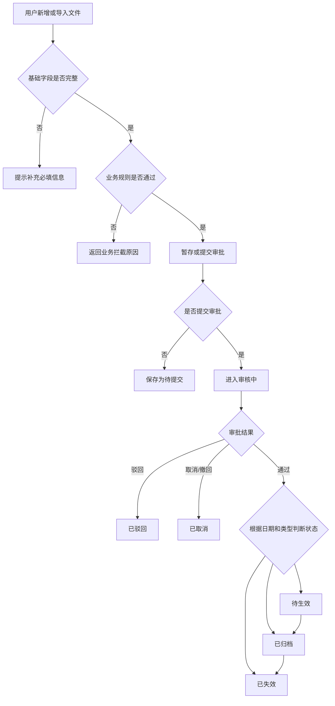
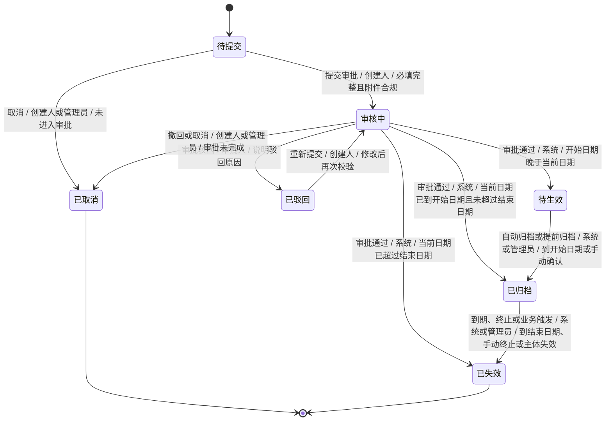

# 生命周期类文件管理 PRD 示例

> This Markdown example is distilled from an original contract/agreement management PRD document.
> Images, embedded spreadsheets, and screenshots are not included. Use bracketed notes such as `[图片占位：系统流程图]` when a visual artifact exists in the source document.

## 目录

- [文档信息](#文档信息)
- [需求变更说明](#需求变更说明)
- [一、需求整体描述](#一需求整体描述)
- [二、需求分析](#二需求分析)
- [三、系统功能描述](#三系统功能描述)
- [四、功能性需求细节讲解](#四功能性需求细节讲解)
- [五、权限管理](#五权限管理)
- [六、非功能性需求描述](#六非功能性需求描述)
- [七、项目管理](#七项目管理)
- [待确认事项](#待确认事项)

## 文档信息

| 字段 | 示例 |
| --- | --- |
| 需求名称 | 文件/协议生命周期管理 |
| 版本 | 1期 |
| 文档类型 | PRD 示例 |
| 适用场景 | 文件、协议、合同等生命周期管理 |
| 相关附件 | `[图片占位：业务流程图]`、`[图片占位：状态机图]`、`[附件占位：项目计划表]` |

## 需求变更说明

| 变更描述 | 更新人 | 更新时间 |
| --- | --- | --- |
| 新增特殊文件类型纳入本期处理 | 产品负责人 | YYYY/MM/DD |
| 新增特殊场景下的延期能力 | 产品负责人 | YYYY/MM/DD |
| 新增业务属性字段 | 产品负责人 | YYYY/MM/DD |
| 补充续期/续签限制逻辑：同一主体同一文件只允许有效续期一次，减少重复数据 | 产品负责人 | YYYY/MM/DD |

## 一、需求整体描述

### 1.1 背景

随着业务规模和组织复杂度提升，线下文件或协议管理无法满足多地区、多角色、多流程协同场景。此类文件通常具备合规、审计或法律效力，对线上化留痕、标准化流程、权限控制和生命周期管理要求较高。

### 1.2 目标

| 目标类型 | 目标描述 | 衡量指标 |
| --- | --- | --- |
| 业务目标 | 实现文件从创建、审批、生效、归档、失效到查询的线上化管理 | 关键文件线上覆盖率、缺失率、处理时效 |
| 用户目标 | 降低人工维护成本，提升信息完整性和准确性 | 人工补录次数、审批退回率 |
| 系统目标 | 统一状态机、权限、导入导出和下游同步规则 | 状态流转准确率、同步成功率 |

### 1.3 项目范围

#### 1.3.1 涉及系统

| 系统 | 参与范围 | 上下游关系 |
| --- | --- | --- |
| 文件生命周期管理系统 | 主系统，承载列表、详情、审批、导入导出、状态流转 | 上游接收业务数据，下游输出状态 |
| 业务主数据系统 | 提供人员、组织、主体、地区等基础数据 | 上游 |
| 审批系统 | 承载审批流、审批单据和审批节点判断 | 下游/协同 |
| 电子签或附件平台 | 提供模板、预览、签署文件生成、附件存储 | 下游/协同 |
| 相关业务系统 | 根据文件状态展示或联动处理业务结果 | 下游 |

## 二、需求分析

### 2.1 用户分析

| 用户角色 | 使用场景 | 核心诉求 | 痛点 |
| --- | --- | --- | --- |
| HR | 创建、维护、导入、归档、失效文件 | 高效处理批量文件，降低缺失风险 | 线下管理分散、状态不透明 |
| 审批人 | 审核文件信息和附件 | 快速判断信息是否完整合规 | 审批信息不完整 |
| 普通查看用户 | 查询个人或授权范围内文件 | 能查看有效文件和关键字段 | 权限和数据口径不统一 |
| 系统管理员 | 配置权限、模板、导入导出 | 可控、可追溯、可审计 | 敏感附件风险高 |

### 2.2 业务文档附件

| 文档名称 | 类型 | 说明 |
| --- | --- | --- |
| 业务流程图 | 图片 | `[图片占位：业务流程图]` |
| 系统流程图 | 图片 | `[图片占位：系统流程图]` |
| 状态机图 | 图片 | `[图片占位：状态机图]` |
| 项目计划表 | 嵌入表格 | `[附件占位：项目计划表]` |

### 2.3 业务流程或逻辑

1. 管理员新增或导入文件信息。
2. 系统根据主体、文件类型、日期、附件、权限等规则进行校验。
3. 用户暂存或提交审批。
4. 审批通过后，系统根据开始日期、结束日期、业务类型判断进入待生效、已归档或已失效。
5. 文件在生命周期内支持查看、编辑、取消、重新提交、提前归档、终止、续期、延期等操作。
6. 文件状态变化后，同步影响下游展示、接口输出、附件权限和审计记录。

## 三、系统功能描述

### 3.1 系统场景

| 场景编号 | 场景名称 | 参与角色 | 前置条件 | 预期结果 |
| --- | --- | --- | --- | --- |
| S-001 | 新增文件并提交审批 | 管理员 | 主体信息存在，文件类型可用 | 文件进入审核中 |
| S-002 | 文件审批通过后生效 | 审批人、系统 | 审批通过，日期满足规则 | 文件进入待生效/已归档/已失效 |
| S-003 | 文件到期自动失效 | 系统 | 当前日期超过结束日期 | 文件进入已失效并记录终止日期 |
| S-004 | 历史文件批量导入 | 管理员 | 导入模板字段完整 | 文件按日期规则落入对应状态 |
| S-005 | 敏感附件查看 | 授权用户 | 具备附件权限或为创建人 | 可查看或下载附件 |

### 3.2 系统流程

### 3.3 状态机

### 3.4 功能需求清单

| 功能编号 | 功能名称 | 优先级 | 需求描述 |
| --- | --- | --- | --- |
| FR-001 | 列表与筛选 | P0 | 按状态 Tab、组织、主体、日期、文件类型等筛选文件 |
| FR-002 | 新增/编辑文件 | P0 | 支持填写基础信息、业务字段、附件和模板 |
| FR-003 | 审批流转 | P0 | 支持提交、审批、驳回、重新提交、取消 |
| FR-004 | 生命周期操作 | P0 | 支持归档、终止、续期、延期和自动失效 |
| FR-005 | 导入导出 | P1 | 支持历史文件导入和授权范围内导出 |
| FR-006 | 权限控制 | P0 | 支持菜单、按钮、数据、附件权限控制 |

## 四、功能性需求细节讲解

### 4.1 菜单：文件生命周期管理

#### 4.1.1 页面：管理列表

##### Tab 与排序

| Tab | 说明 | 默认排序 |
| --- | --- | --- |
| 待处理/待提交 | 需要用户补充或提交的文件 | 最近操作时间倒序 |
| 审核中 | 已提交审批但未完成的文件 | 最近操作时间倒序 |
| 已驳回 | 审批驳回后待处理的文件 | 最近操作时间倒序 |
| 待生效 | 已审批通过但未到生效日期的文件 | 开始日期升序 |
| 已归档/生效中 | 当前有效或已归档的文件 | 最近操作时间倒序 |
| 已失效 | 已到期、终止或业务触发失效的文件 | 终止日期倒序 |
| 已取消 | 用户取消或系统取消的文件 | 最近操作时间倒序 |
| 全部 | 汇总展示所有状态 | 最近操作时间倒序 |

##### 筛选项

| 字段 | 类型 | 是否必填 | 默认值 | 规则说明 |
| --- | --- | --- | --- | --- |
| 组织/部门 | 侧边筛选 | 否 | 当前权限范围 | 按数据权限过滤 |
| 账号/姓名/主体 | 文本输入框 | 否 | 空 | 支持模糊或精准搜索 |
| 开始日期 | 日期范围 | 否 | 空 | 按文件开始日期筛选 |
| 结束日期 | 日期范围 | 否 | 空 | 按文件结束日期筛选 |
| 终止日期 | 日期范围 | 否 | 空 | 仅失效/全部等场景展示 |
| 即将到期 | 快捷筛选 | 否 | 空 | 筛选结束日期在当天到未来 N 天的文件 |
| 工作/业务状态 | 下拉单选 | 否 | 全部 | 按主体当前状态过滤 |
| 文件状态 | 下拉单选 | 否 | 全部 | 全部 Tab 可用 |
| 文件类型 | 下拉多选 | 否 | 全部 | 根据业务枚举展示 |
| 地区/常驻地 | 下拉单选 | 否 | 全部 | 与数据权限联动 |

##### 列表字段

| 字段 | 说明 |
| --- | --- |
| 主体账号/编号 | 文件关联主体唯一标识 |
| 主体名称 | 文件关联主体名称 |
| 组织/部门 | 当前组织或部门 |
| 业务类型 | 员工、供应商、客户、项目等业务分类 |
| 主体状态 | 在职、离职、有效、停用等 |
| 文件状态 | 待提交、审核中、已归档、已失效等 |
| 文件类型 | 根据业务配置展示 |
| 文件名称 | 用户录入或系统生成 |
| 文件编号 | 提交审核时生成，示例：DOC-YYYY-MM-DD-001 |
| 开始日期 | 文件生效日期 |
| 结束日期 | 文件默认失效日期 |
| 终止日期 | 实际失效日期 |
| 最近操作人 | 最近更新人 |
| 最近操作时间 | 最近更新时间 |

### 4.2 页面：新增/编辑文件

#### 新增/编辑文件表单字段

> 本表描述用户点击列表顶部「新增文件」或列表行「编辑/重新提交/续期」后，在新增/编辑页面内需要维护的业务表单字段。筛选项和列表字段不放在这里。

| 字段 | 类型 | 是否必填 | 规则说明 |
| --- | --- | --- | --- |
| 签署/关联主体 | 联想输入框 | 是 | 支持名称模糊搜索、编号精准搜索；仅可选择有效主体 |
| 主体信息 | 信息展示 | 否 | 展示组织、岗位/角色、类型、入职/创建日期、地区等 |
| 文件类型 | 下拉单选 | 是 | 根据主体类型展示可选文件类型 |
| 文件名称 | 单行文本 | 条件必填 | 上限 100 字符 |
| 签约/责任主体 | 下拉单选 | 是 | 根据主体类型和启用状态提供选项 |
| 是否续期/续签 | 单选 | 是 | 默认否；部分特殊类型不可修改 |
| 是否固定期限 | 单选 | 是 | 无固定期限时不展示结束日期 |
| 开始日期 | 日期选择器 | 是 | 文件开始生效日期 |
| 结束日期 | 日期选择器 | 条件必填 | 必须大于开始日期；无固定期限可为空 |
| 备注 | 多行文本 | 否 | 上限 500 字符 |
| 电子文件模板 | 下拉单选 | 否 | 来自启用中的模板配置 |
| 附件上传 | 文件上传 | 是 | 支持 PDF/Word；限制数量和单文件大小 |

#### 列表顶部操作

| 操作 | 入口位置 | 前置条件 | 处理逻辑 | 成功结果 |
| --- | --- | --- | --- | --- |
| 新增文件 | 列表页顶部主按钮 | 用户具备新增权限 | 打开新增页面或弹窗 | 进入新增文件流程 |
| 导入待处理文件 | 列表页顶部导入按钮 | 用户具备导入权限 | 上传导入模板并校验主体、文件类型、附件格式 | 生成待提交/待处理记录 |
| 导入归档文件 | 列表页顶部导入按钮 | 用户具备导入权限 | 上传历史文件，按日期规则判断状态 | 生成已归档或已失效记录 |
| 导出 | 全部 Tab 或授权列表页顶部 | 用户具备导出权限 | 按当前筛选条件或勾选数据导出 | 生成导出文件 |

#### 列表行操作

| 操作 | 展示位置 | 可见条件 | 处理逻辑 | 成功结果 |
| --- | --- | --- | --- | --- |
| 查看 | 行操作区 | 用户具备查看权限 | 进入详情页，展示字段、附件和审批流程 | 展示文件详情 |
| 编辑 | 行操作区 | 状态允许编辑且用户具备编辑权限 | 复用新增页面，回显并允许修改指定字段 | 保存更新 |
| 取消 | 行操作区/更多菜单 | 状态允许取消且用户具备取消权限 | 二次确认后取消 | 状态为已取消 |
| 重新提交 | 行操作区 | 文件已驳回且用户具备提交权限 | 修改指定字段后重新提交 | 状态为审核中 |
| 提前归档 | 行操作区/更多菜单 | 文件待生效且用户具备归档权限 | 二次确认后归档 | 状态为已归档 |
| 终止履约/失效 | 行操作区/更多菜单 | 文件已归档/生效中且用户具备终止权限 | 选择终止日期并确认 | 状态为已失效 |
| 续期/续签 | 行操作区/更多菜单 | 符合续期条件且无有效续期记录 | 复用新增页面并带出部分字段 | 生成新文件记录 |
| 延期 | 行操作区/更多菜单 | 固定期限且状态允许延期 | 选择延长后的结束日期 | 更新结束日期 |

#### 列表行操作状态映射

| 当前状态 | 展示操作 | 隐藏/禁用操作 | 操作约束 | 操作后状态 |
| --- | --- | --- | --- | --- |
| 待提交 | 查看、编辑、提交审批、取消 | 重新提交、提前归档、终止、续期、延期 | 仅创建人或具备管理权限的用户可操作 | 提交后审核中；取消后已取消 |
| 审核中 | 查看、取消 | 编辑、重新提交、提前归档、终止、续期、延期 | 审批未完成时可取消；是否允许撤回按审批系统规则 | 取消后已取消；审批完成后按审批结果流转 |
| 已驳回 | 查看、编辑、重新提交、取消 | 提前归档、终止、续期、延期 | 修改后需重新校验必填项、附件和审批流 | 重新提交后审核中；取消后已取消 |
| 待生效 | 查看、提前归档、取消 | 编辑、重新提交、终止、续期、延期 | 未到开始日期；可由系统到期自动归档或人工提前归档 | 归档后已归档；取消后已取消 |
| 已归档/生效中 | 查看、终止、续期、延期 | 编辑、重新提交、取消、提前归档 | 续期需满足无有效续期记录；延期仅固定期限文件可操作 | 终止后已失效；续期生成新记录；延期不改变当前状态 |
| 已失效 | 查看 | 编辑、取消、重新提交、提前归档、终止、续期、延期 | 仅允许查看和附件授权操作 | 不流转 |
| 已取消 | 查看 | 编辑、取消、重新提交、提前归档、终止、续期、延期 | 仅允许查看历史记录 | 不流转 |

#### 页面内操作

| 操作 | 所属页面 | 入口位置 | 前置条件 | 处理逻辑 | 成功结果 |
| --- | --- | --- | --- | --- | --- |
| 预览文件 | 新增/编辑页 | 表单内按钮 | 已选择模板且关键信息完整 | 调用模板或电子签平台生成预览 | 展示预览文件 |
| 下载模板 | 新增/编辑页 | 表单内按钮 | 已选择模板且关键信息完整 | 生成文件模板 | 下载文件 |
| 上传附件 | 新增/编辑页 | 附件上传控件 | 文件格式和大小符合规则 | 上传并关联当前记录 | 附件展示在表单内 |
| 删除附件 | 新增/编辑页 | 附件区域 | 附件未被锁定且用户具备编辑权限 | 删除附件关联 | 附件从表单移除 |
| 暂存 | 新增/编辑页 | 页面底部按钮 | 无需校验全部必填项 | 保存已填写内容 | 状态为待提交 |
| 提交审批 | 新增/编辑页 | 页面底部按钮 | 必填项完整且附件合规 | 校验审批流后提交 | 状态为审核中 |
| 查看/下载附件 | 详情页 | 附件区域 | 用户具备附件查看或下载权限 | 打开预览或下载文件 | 记录附件访问日志 |
| 关闭/返回 | 新增/编辑/详情页 | 页面顶部或底部按钮 | 无 | 返回列表页 | 保持原筛选条件 |

#### 其他页面内操作表单字段

##### 表单：终止履约/失效

| 字段 | 类型 | 是否必填 | 默认值 | 校验规则 | 说明 |
| --- | --- | --- | --- | --- | --- |
| 终止日期 | 日期选择器 | 是 | 操作当天 | 范围为文件开始日期至文件结束日期，包含边界值 | 保存后文件进入已失效 |
| 终止原因 | 下拉/文本域 | 视业务而定 | 空 | 按业务枚举或文本上限校验 | 用于审计和后续查询 |

##### 表单：延期

| 字段 | 类型 | 是否必填 | 默认值 | 校验规则 | 说明 |
| --- | --- | --- | --- | --- | --- |
| 延长后的结束日期 | 日期选择器 | 是 | 空 | 必须大于当前结束日期 | 非固定期限文件不展示延期操作 |
| 延期原因 | 文本域 | 视业务而定 | 空 | 上限按业务要求配置 | 用于审计和审批判断 |

##### 表单：导入确认

| 字段 | 类型 | 是否必填 | 默认值 | 校验规则 | 说明 |
| --- | --- | --- | --- | --- | --- |
| 导入类型 | 单选 | 是 | 待处理文件导入 | 待处理文件导入 / 归档文件导入 | 决定导入后状态判断规则 |
| 导入文件 | 文件上传 | 是 | 空 | 模板格式正确，大小不超过限制 | 上传 Excel 或 CSV 模板 |
| 错误处理方式 | 单选 | 是 | 全部成功后导入 | 全部成功后导入 / 跳过错误行 | 影响导入事务策略 |

### 4.3 导出功能

| 项目 | 说明 |
| --- | --- |
| 导出入口 | 全部 Tab 或授权列表页 |
| 导出范围 | 当前筛选结果或勾选数据 |
| 导出字段 | 主体信息、文件状态、文件类型、文件名称、是否续期、是否固定期限、开始日期、结束日期、终止日期、组织、业务属性、最近操作人、最近操作时间等 |
| 多语言字段 | 如系统有国际化要求，可同时输出中英文字段 |
| 权限控制 | 仅导出当前用户有数据权限的数据 |

### 4.4 导入功能

| 导入类型 | 导入后状态 | 校验规则 |
| --- | --- | --- |
| 待处理文件导入 | 待提交/待处理 | 校验主体、文件类型、主体类型、附件格式 |
| 归档文件导入 | 根据日期判断为已归档或已失效 | 校验开始日期、结束日期、终止日期和主体类型 |

### 4.5 生命周期规则

| 规则 | 说明 |
| --- | --- |
| 自动归档 | 待生效文件到开始日期自动归档 |
| 提前归档 | 管理员可手动将待生效文件提前归档 |
| 自动失效 | 文件到结束日期后自动失效，终止日期等于结束日期 |
| 手动终止 | 管理员可选择终止日期使文件失效 |
| 业务触发失效 | 主体离职、停用或其他业务事件可触发失效 |
| 续期限制 | 同一主体同一文件在有效续期链路中只允许存在一次有效续期 |
| 延期限制 | 非固定期限文件不支持延期 |

### 4.6 审批与外部系统对接

| 模块 | 规则 |
| --- | --- |
| 审批单据 | 提交后生成审批单，单号按业务规则生成 |
| 审批判断节点 | 可按是否续期、文件类型、主体类型等字段判断 |
| 我的申请 | 如流程由主系统管理，可隐藏审批系统内撤回/重新提交入口 |
| 模板平台 | 根据文件类型匹配启用模板，支持预览、下载、签署 |
| 入职/创建流程 | 上游业务确认后自动生成待处理记录 |
| 档案/详情页 | 下游页面按主体状态和文件状态展示有效文件 |

## 五、权限管理

### 5.1 菜单权限

| 菜单 | 查看 | 新增 | 编辑 | 删除/取消 | 导入 | 导出 |
| --- | --- | --- | --- | --- | --- | --- |
| 文件生命周期管理 | 是 | 按角色 | 按状态和角色 | 按状态和角色 | 按角色 | 按角色 |
| 文件模板管理 | 按角色 | 按角色 | 按角色 | 按角色 | 不适用 | 不适用 |

### 5.2 按钮权限

| 一级菜单 | 按钮 | 说明 |
| --- | --- | --- |
| 文件生命周期管理 | 新增 | 创建文件 |
| 文件生命周期管理 | 查看 | 查看详情 |
| 文件生命周期管理 | 查看文件 | 查看敏感附件 |
| 文件生命周期管理 | 下载文件 | 下载敏感附件 |
| 文件生命周期管理 | 编辑 | 编辑指定状态文件 |
| 文件生命周期管理 | 重新提交 | 驳回后重新提交 |
| 文件生命周期管理 | 取消 | 取消待处理或审核中文件 |
| 文件生命周期管理 | 延期 | 延长结束日期 |
| 文件生命周期管理 | 提前归档 | 手动归档 |
| 文件生命周期管理 | 终止履约 | 手动失效 |
| 文件生命周期管理 | 续期/续签 | 创建续期文件 |
| 文件生命周期管理 | 导出 | 导出授权数据 |
| 文件生命周期管理 | 导入 | 导入待处理或历史文件 |

### 5.3 数据权限

| 场景 | 数据可见范围 | 数据权限来源 | 过滤规则 | 无数据权限时表现 |
| --- | --- | --- | --- | --- |
| 合同/文件列表 | 展示当前登录账号拥有部门数据权限和地区权限范围内的文件 | 权限系统中的部门数据权限、地区权限 | 按文件关联主体的部门、常驻地过滤；组合规则按业务要求取交集或并集 | 列表为空或展示无权限提示 |
| 文件详情页 | 仅允许查看当前登录账号在列表中有权限看到的数据详情 | 同列表页数据权限 | 打开详情时再次校验当前文件是否仍在可见范围内 | 展示无权限页或返回列表 |
| 导出 | 仅导出当前筛选条件下且当前登录账号有数据权限的文件 | 同列表页数据权限、导出按钮权限 | 导出结果不得超出当前用户可见数据范围 | 禁止导出或提示无可导出数据 |
| 附件查看/下载 | 仅允许有附件权限的用户查看/下载；创建人可作为例外规则 | 附件按钮权限、创建人规则 | 附件权限独立于详情查看权限 | 隐藏附件入口或提示无附件权限 |

### 5.4 附件权限

- 文件附件可能包含敏感信息，查看和下载应独立配置功能权限。
- 默认通过权限系统控制附件查看/下载。
- 特殊场景下，创建人可查看和下载自己创建的附件。
- 所有附件访问应记录操作日志。

## 六、非功能性需求描述

### 6.1 附件文件加密管理

- 附件上传后应进行加密存储或受控访问。
- 附件预览、下载、删除、替换需要记录审计日志。
- 敏感附件建议支持水印、下载限制、过期链接或访问鉴权。

### 6.2 历史数据处理方案

#### 6.2.1 初始化的数据内容

本期需要初始化线下历史文件数据，包括历史合同、历史协议、已归档文件、已失效文件及其附件。业务侧需要在上线前整理需要初始化的数据范围，并明确文件关联主体、文件类型、开始日期、结束日期、终止日期、附件等关键信息。

历史数据处理不及时可能影响下游档案展示、报销、差旅或其他依赖文件状态的业务判断。

#### 6.2.2 处理方式

历史数据通过归档文件导入能力进行初始化。业务侧负责收集和确认初始化数据，产品和测试负责确认导入模板、字段口径和抽检规则，开发侧根据导入规则完成数据导入或补录支持。

导入时需要校验主体是否存在、文件类型是否匹配、日期是否合法、附件格式是否符合要求。导入后根据导入日期、开始日期、结束日期判断文件状态为已归档或已失效；异常数据由业务侧确认后重新整理或手工补录。

### 6.3 快照处理方案

- 如业务需要查看当前主体信息，可不做历史快照，实时读取主体当前信息。
- 如业务需要还原签署时信息，应保存签署人员账号、组织、岗位、业务类型、入职日期、常驻地等快照字段。
- 是否保存快照需要在 PRD 中明确，避免后续争议。

### 6.4 对外接口

| 输入条件 | 输出结果 |
| --- | --- |
| 主体状态、主体类型、文件状态、文件类型 | 返回当前有效文件或指定状态文件 |
| 离职/停用等业务事件 | 返回需自动取消或失效的文件 |

## 七、项目管理

### 7.1 项目计划

`[附件占位：项目计划表，源文档中为嵌入 Excel 或图片表格]`

### 7.2 风险管理

| 风险 | 说明 | 应对方式 |
| --- | --- | --- |
| 地区合规差异 | 不同国家或地区对附件收集和保存要求不同 | 按地区控制附件必填和留存策略 |
| 特殊文件类型规则复杂 | 某些文件的生效规则与普通文件不同 | 单独建模状态和触发条件 |
| 主数据变更影响历史文件 | 主体类型或签约主体变化后，历史文件可能需要联动 | 明确本期是否处理，未处理则列入范围外 |
| 历史数据初始化不足 | 影响下游接口、档案展示和业务判断 | 上线前完成 UAT 数据初始化和业务核对 |

## 待确认事项

| 编号 | 问题 | 影响范围 |
| --- | --- | --- |
| Q-001 | 是否需要保存签署时主体信息快照 | 详情展示、历史追溯 |
| Q-002 | 附件是否按地区或文件类型控制必填 | 提交审批、合规 |
| Q-003 | 主体状态变化后是否自动触发文件失效 | 状态机、下游接口 |
| Q-004 | 续期链路是否允许多次续期 | 数据结构、按钮展示 |
