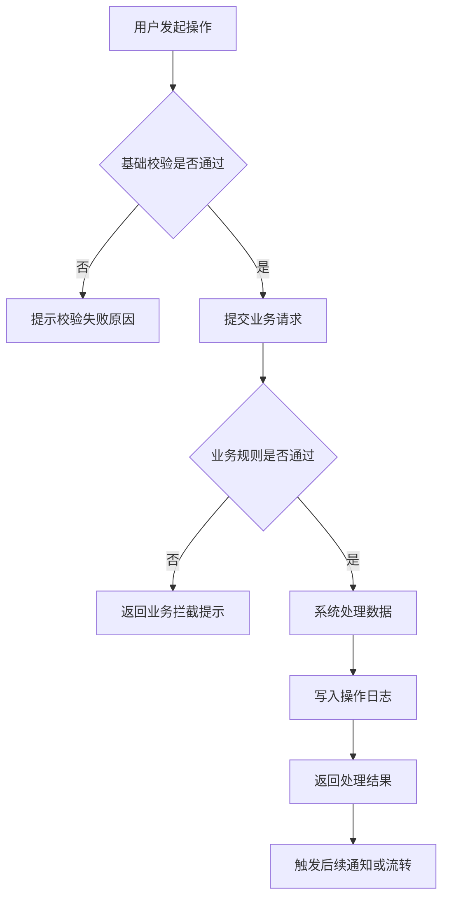
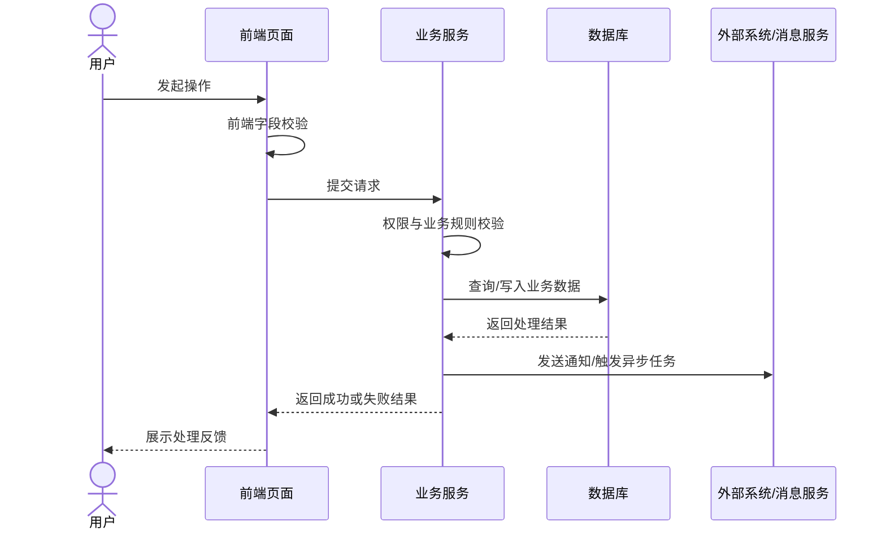
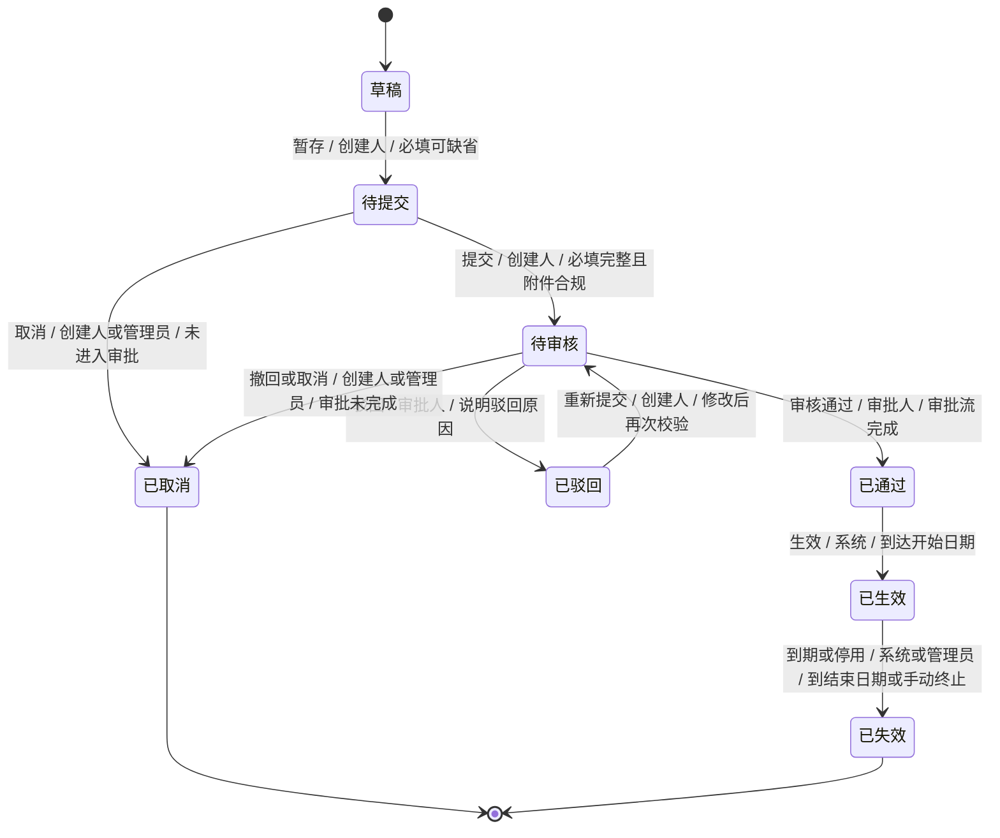

# PRD 模板

## 文档信息

| 字段 | 内容 |
| --- | --- |
| 需求名称 | 待补充 |
| 需求编号 | 待补充 |
| 版本 | V1.0 |
| 产品负责人 | 待补充 |
| 业务负责人 | 待补充 |
| 技术负责人 | 待补充 |
| 创建日期 | 待补充 |
| 当前状态 | 草稿 / 评审中 / 已确认 / 开发中 / 已上线 |
| 相关文档 | 待补充 |

## 一、需求整体描述

### 1.1 背景

- 业务背景：
- 当前问题：
- 触发原因：
- 相关数据或案例：

### 1.2 目标

| 目标类型 | 目标描述 | 衡量指标 |
| --- | --- | --- |
| 业务目标 | 待补充 | 待补充 |
| 用户目标 | 待补充 | 待补充 |
| 系统目标 | 待补充 | 待补充 |

### 1.3 项目范围

#### 1.3.1 涉及系统

| 系统 | 参与范围 | 上下游关系 | 负责人 |
| --- | --- | --- | --- |
| 待补充 | 待补充 | 待补充 | 待补充 |

## 二、需求分析

### 2.1 用户分析

| 用户角色 | 使用场景 | 核心诉求 | 痛点 | 使用频率 |
| --- | --- | --- | --- | --- |
| 待补充 | 待补充 | 待补充 | 待补充 | 待补充 |

### 2.2 业务文档附件

| 文档名称 | 类型 | 说明 | 链接或位置 |
| --- | --- | --- | --- |
| 待补充 | 业务规则  / 其他 | 待补充 | 待补充 |

### 2.3 业务流程或逻辑

#### 2.3.1 业务主流程

1. 待补充
2. 待补充
3. 待补充

#### 2.3.2 关键业务规则

| 规则编号 | 规则说明 | 触发条件 | 处理逻辑 | 异常处理 |
| --- | --- | --- | --- | --- |
| BR-001 | 待补充 | 待补充 | 待补充 | 待补充 |

## 三、系统功能描述

### 3.1 系统场景

| 场景编号 | 场景名称 | 参与角色 | 前置条件 | 触发方式 | 预期结果 |
| --- | --- | --- | --- | --- | --- |
| S-001 | 待补充 | 待补充 | 待补充 | 待补充 | 待补充 |

### 3.2 系统流程

#### 3.2.1 系统流程图

#### 3.2.2 系统交互时序图

#### 3.2.3 流程节点说明

| 节点 | 处理主体 | 输入 | 处理逻辑 | 输出 | 异常处理 |
| --- | --- | --- | --- | --- | --- |
| 用户发起操作 | 用户 / 前端 | 待补充 | 待补充 | 待补充 | 待补充 |
| 基础校验 | 前端 / 后端 | 待补充 | 待补充 | 待补充 | 待补充 |
| 业务规则校验 | 后端服务 | 待补充 | 待补充 | 待补充 | 待补充 |
| 数据处理 | 后端服务 / 数据库 | 待补充 | 待补充 | 待补充 | 待补充 |
| 后续通知或流转 | 消息服务 / 外部系统 | 待补充 | 待补充 | 待补充 | 待补充 |

### 3.3 状态机

#### 3.3.1 状态机图

#### 3.3.2 状态流转补充规则

> 状态流转的核心规则应优先写入状态机箭头标签；本表仅补充图中不适合承载的数据写入、通知、权限和边界规则。

| 流转 | 数据写入 | 通知对象 | 权限要求 | 边界说明 |
| --- | --- | --- | --- | --- |
| 待补充 -> 待补充 | 待补充 | 待补充 | 待补充 | 待补充 |

#### 3.3.3 状态异常与回滚

| 场景 | 当前状态 | 处理方式 | 目标状态 | 数据影响 | 通知对象 |
| --- | --- | --- | --- | --- | --- |
| 审核驳回 | 待补充 | 待补充 | 待补充 | 待补充 | 待补充 |
| 用户撤回 | 待补充 | 待补充 | 待补充 | 待补充 | 待补充 |
| 系统处理失败 | 待补充 | 待补充 | 待补充 | 待补充 | 待补充 |
| 超时未处理 | 待补充 | 待补充 | 待补充 | 待补充 | 待补充 |

### 3.4 功能需求清单

| 功能编号 | 功能名称 | 优先级 | 所属菜单/页面 | 需求描述 | 验收标准 |
| --- | --- | --- | --- | --- | --- |
| FR-001 | 待补充 | P0/P1/P2 | 待补充 | 待补充 | 待补充 |

## 四、功能性需求细节讲解

> 按菜单、页面、功能点拆解。每个页面应说明筛选、列表、操作、表单、导出、校验、权限、页面状态和用户提示。

### 4.1 菜单：待补充

#### 4.1.1 页面：待补充

##### 页面目标

- 待补充

##### 页面入口

- 菜单路径：

##### 筛选项

| 字段 | 类型 | 是否必填 | 默认值 | 选项来源 | 规则说明 |
| --- | --- | --- | --- | --- | --- |
| 待补充 | 输入框 / 下拉 / 日期 / 多选 / 级联 | 否 | 待补充 | 待补充 | 待补充 |

##### 列表字段

| 字段 | 字段含义 | 数据来源 | 排序/筛选 | 展示规则 |
| --- | --- | --- | --- | --- |
| 待补充 | 待补充 | 待补充 | 待补充 | 待补充 |

##### 列表顶部操作

| 操作 | 入口位置 | 操作角色 | 前置条件 | 处理逻辑 | 成功反馈 | 失败反馈 |
| --- | --- | --- | --- | --- | --- | --- |
| 新增 / 导入 / 导出 / 批量操作 | 页面顶部 / 工具栏 | 待补充 | 待补充 | 待补充 | 待补充 | 待补充 |

##### 列表行操作

| 操作 | 入口位置 | 可见条件 | 操作角色 | 前置状态 | 处理逻辑 | 流转后状态 |
| --- | --- | --- | --- | --- | --- | --- |
| 查看 / 编辑 / 删除 / 取消 / 重新提交 / 审核 / 撤回 | 行操作区 / 更多菜单 | 待补充 | 待补充 | 待补充 | 待补充 | 待补充 |

##### 列表行操作状态映射

> 列表行操作通常与当前数据状态强相关，需要按状态说明行操作菜单展示哪些操作、隐藏哪些操作、操作后流转到什么状态。

| 当前状态 | 展示操作 | 隐藏/禁用操作 | 操作角色 | 操作约束 | 操作后状态 |
| --- | --- | --- | --- | --- | --- |
| 待补充 | 查看 / 编辑 / 取消 | 待补充 | 待补充 | 待补充 | 待补充 |

##### 页面内操作

| 操作 | 入口 | 操作角色 | 前置条件 | 处理逻辑 | 成功反馈 | 失败反馈 |
| --- | --- | --- | --- | --- | --- | --- |
| 暂存 / 提交 / 取消 / 关闭 / 预览 / 下载 / 上传 / 删除附件 | 表单底部 / 详情页按钮 / 弹窗按钮 | 待补充 | 待补充 | 待补充 | 待补充 | 待补充 |

##### 页面内操作表单字段

> 表单字段指页面内操作触发后需要用户维护的业务字段，例如新增合同、编辑合同、终止履约、延期、导入确认等操作中的表单字段；不要与筛选项或列表字段混用。

###### 表单：待补充（对应操作：新增 / 编辑 / 终止 / 延期 / 其他）

| 字段 | 组建类型 | 是否必填 | 默认值 | 校验规则 | 联动规则 | 说明 |
| --- | --- | --- | --- | --- | --- | --- |
| 待补充 | 单行输入框 / 下拉 / 日期 / 上传 / 单选 / 多选 / 文本域 | 是/否/条件必填 | 待补充 | 待补充 | 待补充 | 待补充 |

##### 导出功能

| 项目 | 说明 |
| --- | --- |
| 导出入口 | 待补充 |
| 导出范围 | 当前筛选结果 / 勾选数据 / 全量数据 |
| 导出字段 | 待补充 |
| 文件格式 | xlsx / csv / pdf / 其他 |
| 文件命名 | 待补充 |
| 权限控制 | 待补充 |
| 异步处理 | 是否需要异步任务、通知、下载中心 |

##### 页面状态与提示

| 场景 | 触发条件 | 页面表现 | 提示文案 | 后续操作 |
| --- | --- | --- | --- | --- |
| 无数据 | 待补充 | 空状态插画/文案/按钮 | 待补充 | 待补充 |
| 无筛选结果 | 待补充 | 空列表 | 待补充 | 支持清空筛选/重新查询 |
| 无权限 | 当前用户无菜单、数据或操作权限 | 隐藏入口/置灰按钮/权限提示页 | 待补充 | 引导联系管理员或返回 |
| 校验未通过 | 表单字段、附件、业务规则未满足 | 字段报错/顶部提示/弹窗提示 | 待补充 | 用户修改后重试 |
| 操作失败 | 用户操作未成功完成 | 保留当前页面和已填内容 | 待补充 | 支持重试或返回 |

## 五、权限管理

> 系统整体权限由权限系统配置时，PRD 只需要说明本需求涉及的菜单、按钮和数据可见范围，不需要重新定义角色。

### 5.1 菜单及按钮权限

| 菜单名称 | 是否新增菜单 | 说明 |
| --- | --- | --- |
| 待补充 | 是/否 | 待补充 |

### 5.2 按钮权限

| 所属菜单/页面 | 按钮/操作  | 无权限时表现 | 说明 |
| --- | --- | --- | --- |
| 待补充 | 新增 / 编辑 / 删除 / 导入 / 导出 / 审核 / 查看附件 | 隐藏 / 置灰 / 提示无权限 | 待补充 |

### 5.3 数据权限

| 场景 | 数据可见范围 | 数据权限来源 | 过滤规则 | 无数据权限时表现 |
| --- | --- | --- | --- | --- |
| 列表页 | 待补充，例如仅展示当前登录账号拥有部门数据权限范围内的数据 | 权限系统 / 主数据部门权限 / 地区权限 / 其他 | 待补充 | 空列表 / 无权限提示 |
| 详情页 | 待补充，例如仅允许查看当前登录账号有权限的数据详情 | 同列表页 / 单独详情权限 | 待补充 | 无权限页 / 返回列表 |
| 导出 | 待补充，例如仅导出当前筛选条件下且当前用户有数据权限的数据 | 同列表页 | 待补充 | 禁止导出 / 导出空文件 / 提示无权限 |
| 附件查看/下载 | 待补充，例如仅允许有附件权限或创建人查看 | 附件权限 / 创建人规则 | 待补充 | 隐藏附件 / 禁止下载 |

### 5.4 权限提示与例外

| 场景 | 页面表现 | 提示文案 | 例外规则 |
| --- | --- | --- | --- |
| 无菜单权限 | 隐藏菜单或展示无权限页 | 待补充 | 待补充 |
| 无按钮权限 | 隐藏按钮或置灰 | 待补充 | 待补充 |
| 无数据权限 | 空列表、无权限页或返回列表 | 待补充 | 待补充 |
| 权限变更 | 待补充 | 待补充 | 待补充 |

## 六、非功能性需求描述

> 本章节面向业务产品和评审人员，描述上线前必须明确的业务侧要求；不要在这里展开技术实现、系统降级、灾备、监控告警等技术方案，除非本需求明确要求。

### 6.1 历史数据处理方案

#### 6.1.1 历史数据内容

说明本次上线前需要纳入系统的历史数据内容，例如线下历史合同数据、历史协议附件、历史审批结果、历史客户资料等。需要写清楚数据范围、时间范围、业务范围，以及是否影响上线后的查询、导出、审批或下游展示。

#### 6.1.2 处理方式

说明历史数据由谁处理、通过什么方式处理，例如开发补录、业务手工录入、批量导入、暂不处理等。需要写清楚业务确认方式、处理截止时间、异常数据如何处理，以及上线前是否需要抽检确认。

### 6.2 数据快照规则

#### 6.2.1 快照场景及字段

说明哪些业务场景需要保留业务发生时的信息，以及需要保留哪些字段。例如入职详情需要保留原始录入数据，涉及字段包括入职日期、部门、岗位等。

## 验收标准

| 编号 | 验收项 | 验收标准 | 验收方式 |
| --- | --- | --- | --- |
| AC-001 | 待补充 | 待补充 | 产品验收 / 测试用例 / 数据核对 |

## 待确认事项

| 编号 | 问题 | 影响范围 | 负责人 | 截止时间 |
| --- | --- | --- | --- | --- |
| Q-001 | 待补充 | 待补充 | 待补充 | 待补充 |
